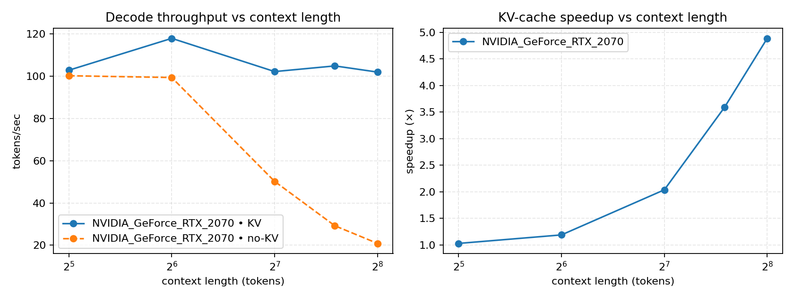
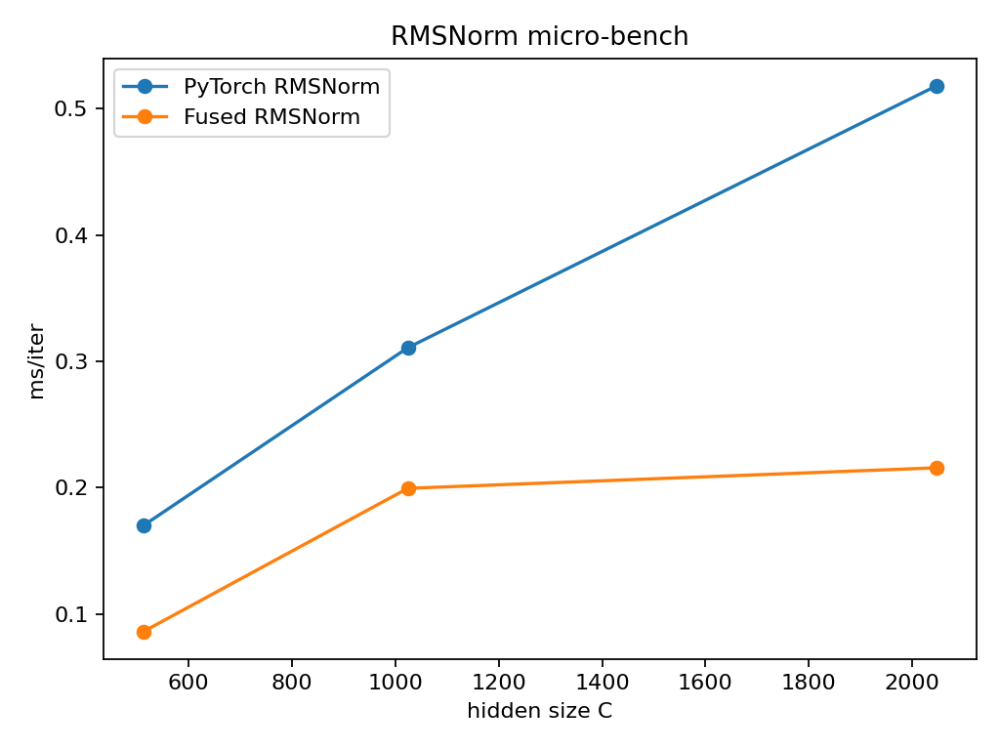
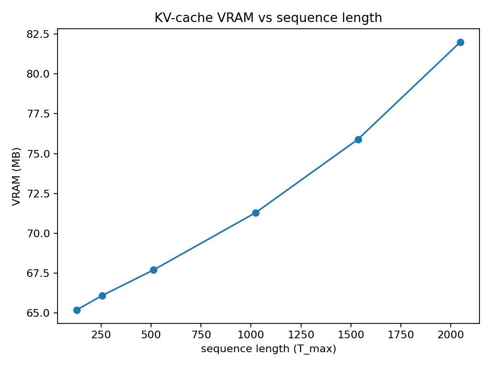

# TinyLM + CUDA RMSNorm + KV-Cache Ablations

TinyLM is a bite-size project to demonstrate end-to-end LM engineering: a compact Transformer, a **fused CUDA RMSNorm** kernel, and **decode-time KV-cache** benchmarks/ablations. It’s designed to be built in \~a day, run on a laptop 2070 Mobile, and scale to a 4090 for larger sweeps.

## Why this exists

* **Training, fast:** a minimal GPT-style TinyLM you can train on TinyShakespeare/TinyStories.
* **Kernel work:** RMSNorm fused in CUDA, compiled as a PyTorch extension, unit-tested and micro-benchmarked.
* **Inference realism:** decode microbench + ablations that isolate the KV-cache effect across context length.

---

## Results (plots + raw CSV)

All artifacts live in [`plots/`](plots/). PNGs are accompanied by CSVs for reproducibility.

### 1) KV-cache throughput vs context length

Left: tokens/sec with and without KV. Right: speedup× (KV / no-KV).
The trend is the point: **with-KV stays \~flat** as context grows, while **no-KV collapses** (recomputes QK over the whole prefix).



* Raw data: [`plots/kv_curve.csv`](plots/kv_curve.csv)
* Single-length bar variant: [`plots/fig_kv_vs_nokv.png`](plots/fig_kv_vs_nokv.png), CSV [`plots/kv_vs_nokv.csv`](plots/kv_vs_nokv.csv)

### 2) Fused RMSNorm micro-bench

Fused RMSNorm consistently outruns the reference PyTorch compose—especially at larger hidden sizes.



* Raw data: [`plots/rmsnorm_bench.csv`](plots/rmsnorm_bench.csv)
* Optional speedup plot: [`plots/fig_rmsnorm_speedup.png`](plots/fig_rmsnorm_speedup.png) if generated

### 3) KV-cache VRAM vs sequence length

Memory grows linearly with the maximum context due to per-layer K/V tensors.



* Raw data: [`plots/vram_seq.csv`](plots/vram_seq.csv)

### 4) Training curve (TinyShakespeare)

Loss curves from a short run—handy to sanity-check the training loop.

* Figure: [`plots/fig_training_curve.png`](plots/fig_training_curve.png)
* Raw log: [`plots/train_log.csv`](plots/train_log.csv)

> Note: end-to-end decode ablation for RMSNorm shows a **small but real** ms/token improvement (the kernel is a small slice of the total). See [`plots/fig_ablation.png`](plots/fig_ablation.png) and [`plots/ablation_rmsnorm.csv`](plots/ablation_rmsnorm.csv) if generated.

---

## What’s inside (high level)

* **Model:** `model.py` implements a lean GPT block with RMSNorm, MHA with rotary embeddings (RoPE), and a simple MLP.
* **CUDA kernel:** `kernels/rmsnorm_cuda.cu` + `kernels/rmsnorm_binding.cpp` compiled via `setup_cuda.py` into `rmsnorm_cuda.*.so`. Exposed as `RMSNormCUDA` and dropped into the model.
* **Tokenizer:** trained on the dataset at runtime (BPE via `tokenizers`).
* **Benches/plots:** in `scripts/` (see below). Figures/CSVs saved to `plots/`.

### Math bits (super brief)

* **RMSNorm** (channel-wise, ε=1e-6):

  $$
  \mathrm{rms}(x)=\sqrt{\tfrac{1}{d}\sum_i x_i^2+\varepsilon},\quad
  \mathrm{RMSNorm}(x)=x\cdot \mathrm{rms}(x)^{-1}\cdot w
  $$

  The fused kernel computes the per-token RMS + scale in one pass with coalesced loads/stores.

* **KV-cache:** at step *t*, reuse K/V from steps `0..t-1` and compute attention with the **new** token only → per-step cost ≈ $O(n\_heads·d\_head·n\_layers)$, instead of recomputing O(T²).

---

## Quickstart (Docker)

> Works on Linux/macOS and Windows (Docker Desktop) with an NVIDIA GPU + recent drivers. Confirm `nvidia-smi` works inside containers.

### 0) Build & enter the dev container

```bash
docker compose run --rm tinylm bash
# or: docker compose -f docker-compose.yml -f compose.2070.yml run --rm tinylm bash
```

### 1) Prepare data

```bash
# TinyShakespeare (fast)
python data/prepare_tinyshakespeare.py
# or TinyStories (bigger)
# python data/prepare_tinystories.py
```

### 2) Build the CUDA extension

```bash
python setup_cuda.py build_ext --inplace
pytest -q  # optional: validate RMSNorm forward/backward against reference
```

### 3) Train a tiny model (quick run)

```bash
# Saves best checkpoint to out/best.pt (or pass OUTDIR below to redirect to plots/)
python train.py --data tinyshakespeare \
  --steps 1500 --batch_size 8 --seq_len 192 \
  --dim 384 --n_layers 6 --n_heads 6 --lr 3e-4 --compile \
  --log_csv plots/train_log.csv
```

### 4) One-button: run benches + make all figures

```bash
# Put all artifacts into plots/
OUTDIR=plots DO_TRAIN=0 bash scripts/run_all.sh
```

This generates (at minimum):

```
plots/
  fig_training_curve.(png|svg)   train_log.csv
  fig_rmsnorm.(png|svg)          rmsnorm_bench.csv
  fig_kv_vs_nokv.(png|svg)       kv_vs_nokv.csv
  fig_kv_curve.(png|svg)         kv_curve.csv
  fig_kv_curve_speedup.(png|svg)
  fig_kv_curve_panels.(png|svg)
  fig_vram_seq.(png|svg)         vram_seq.csv
  fig_tokens_sec.(png|svg)       decode_bench.csv
  fig_ablation.(png|svg)         ablation_rmsnorm.csv   (if enabled)
```

### 5) Inference sanity check

```bash
python infer.py --ckpt out/best.pt --prompt "Once upon a time" --max_new_tokens 80
```

---

## Scripts reference

* **Training log → curve:** `scripts/plot_training_curve.py`
* **RMSNorm microbench:** `scripts/bench_rmsnorm.py` → `scripts/plot_rmsnorm.py`
* **Decode throughput (per GPU label):** `scripts/bench_decode_tps.py` → `scripts/plot_tokens_sec.py`
* **KV vs no-KV (single length):** `scripts/bench_kv_vs_nokv.py` → `scripts/plot_kv_vs_nokv.py`
* **KV vs no-KV (curve across lengths):**
  `scripts/bench_kv_curve.py` → `scripts/plot_kv_curve.py` or `scripts/plot_kv_curve_panels.py`
* **VRAM vs seq length:** `scripts/vram_vs_seq.py` → `scripts/plot_vram_seq.py`
* **End-to-end ablation (ref RMSNorm vs fused):** `scripts/ablation_end2end.py` → `scripts/plot_ablation.py`

> All decode benches cast RoPE tables to the model dtype and **prefill** the cache before incremental steps (so KV results aren’t biased by setup cost).

---

## Reproducing on a bigger GPU (4090)

Run the same commands, but label the device and optionally bump sizes:

```bash
LABEL=RTX4090 OUTDIR=plots DO_TRAIN=0 \
DATASET=tinystories STEPS=4000 BATCH_SIZE=24 SEQ_LEN=512 DIM=768 LAYERS=12 HEADS=12 \
bash scripts/run_all.sh
```

This appends a second line to the KV curves and a second bar in the decode throughput plot, making a nice “laptop vs desktop” contrast.

---

## Repo map (essentials)

```
.
├─ model.py                 # TinyLM + RMSNormCUDA integration
├─ kernels/
│   ├─ rmsnorm_cuda.cu      # fused CUDA kernel
│   └─ rmsnorm_binding.cpp  # PyBind11 binding
├─ setup_cuda.py            # builds the extension
├─ train.py, infer.py       # training & generation
├─ data/prepare_*.py        # tiny datasets
├─ scripts/                 # benches + plotters
└─ plots/                   # figures + CSVs (outputs)
```


