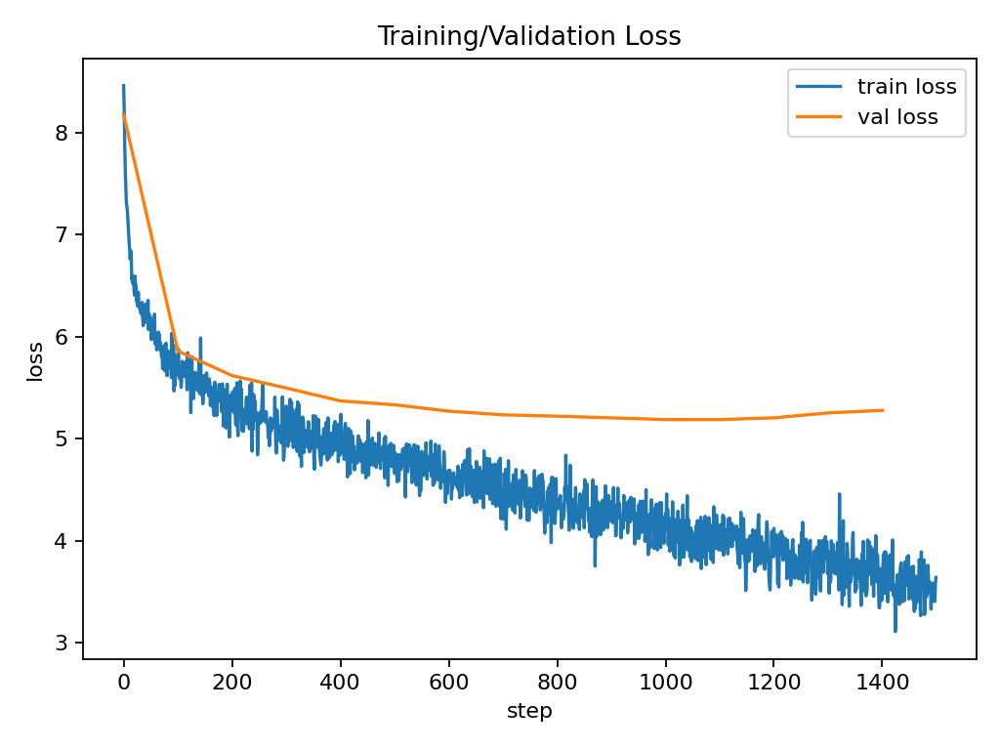
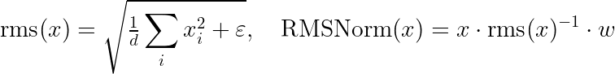

# TinyLM with Custom CUDA RMSNorm

A compact transformer implementation featuring custom CUDA kernels for RMSNorm and comprehensive performance benchmarking. Built to demonstrate ML engineering skills from low-level optimization to full training pipelines.

## Project Overview

This repository implements a small-scale GPT-style language model with several performance optimizations:

- **Custom CUDA kernel** for fused RMSNorm (forward + backward passes)
- **KV-cache implementation** for efficient autoregressive generation
- **Comprehensive benchmarking suite** measuring throughput, memory usage, and speedups
- **End-to-end training pipeline** with tokenizer training and mixed precision support

## Results (plots + raw CSV)

All artifacts live in [`plots/`](plots/). PNGs are accompanied by CSVs for reproducibility.

### 1) KV-cache throughput vs context length

Left: tokens/sec with and without KV. Right: speedup× (KV / no-KV).
The trend is the point: **with-KV stays ~flat** as context grows, while **no-KV collapses** (recomputes QK over the whole prefix).


Based on actual measurements from [`plots/kv_curve.csv`](plots/kv_curve.csv):

| Context Length | Without KV-Cache (tok/s) | With KV-Cache (tok/s) | Speedup |
|---------------|-------------------------|---------------------|---------|
| 32 | 100.2 | 102.8 | 1.03× |
| 64 | 99.4 | 117.9 | 1.19× |
| 128 | 50.2 | 102.2 | 2.04× |
| 256 | 20.9 | 101.9 | **4.88×** |

* Single-length bar variant: [`plots/fig_kv_vs_nokv.png`](plots/fig_kv_vs_nokv.png), CSV [`plots/kv_vs_nokv.csv`](plots/kv_vs_nokv.csv)

### 2) Fused RMSNorm performance

The fused kernel implementation shows consistent performance improvements over the PyTorch reference.


* End-to-end decode ablation (from [`plots/ablation_rmsnorm.csv`](plots/ablation_rmsnorm.csv)):
  - Reference: 11.86 ms/token
  - Fused: 10.00 ms/token
  - **18.6% improvement** in real generation workload

### 3) KV-cache VRAM vs sequence length

Memory grows linearly with the maximum context due to per-layer K/V tensors.


* Raw data: [`plots/vram_seq.csv`](plots/vram_seq.csv) (if generated)

### 4) Training curve (TinyShakespeare)

Loss curves from a training run—demonstrates the model learns effectively.



* Raw log: [`plots/train_log.csv`](plots/train_log.csv) (if generated)

## Technical Implementation

### Architecture Details

**Model Configuration:**
- 6 transformer blocks, 384 hidden dimension, 6 attention heads
- Rotary Position Embeddings (RoPE) instead of learned positional encodings
- RMSNorm instead of LayerNorm for reduced computational overhead
- SiLU activation in feed-forward networks
- No bias terms in linear projections (following modern LLM practices)

**Custom CUDA RMSNorm:**
- Fused forward kernel with block-wise reduction
- Two-pass backward kernel with FP32 gradient accumulation
- Thread-coalesced memory access patterns
- Supports both FP16 and FP32 computation

**KV-Cache Strategy:**
- Pre-allocated cache tensors to avoid reallocation during generation
- Incremental position-based updates
- Reduces per-token complexity from O(T²) to O(T)

### Math bits

* **RMSNorm** (channel-wise, ε=1e-6):



  The fused kernel computes the per-token RMS + scale in one pass with coalesced loads/stores.

* **KV-cache:** at step *t*, reuse K/V from steps `0..t-1` and compute attention with the **new** token only → per-step cost ≈ O(n_heads·d_head·n_layers), instead of recomputing O(T²).

## Repository Structure

```
TinyLM-RMSnorm/
├── model.py                  # Core transformer implementation with type hints
├── train.py                  # Training loop with gradient accumulation
├── infer.py                  # Generation with sampling strategies
├── kernels/
│   ├── rmsnorm_cuda.cu      # CUDA kernel implementation (195 lines)
│   └── rmsnorm_binding.cpp  # PyBind11 wrapper (23 lines)
├── setup_cuda.py            # CUDA extension build configuration
├── tests/
│   └── test_rmsnorm.py      # Kernel validation against reference
├── scripts/
│   ├── bench_*.py           # Individual benchmarks
│   ├── plot_*.py            # Visualization scripts
│   └── run_all.sh          # One-button benchmark suite
├── data/
│   └── prepare_*.py         # Dataset preprocessing
├── plots/                   # Generated figures and CSV outputs
├── docker-compose.yml       # Docker configuration
└── requirements.txt         # Python dependencies
```

## Quick Start

### Prerequisites
- NVIDIA GPU with CUDA 12.1+
- PyTorch 2.2+
- Docker (recommended) or local Python environment

### Docker Setup (Recommended)

```bash
# Build and enter development container
docker compose run --rm tinylm bash

# For RTX 2070 optimization
docker compose -f docker-compose.yml -f compose.2070.yml run --rm tinylm bash
```

### Setup and Training

```bash
# 1. Build CUDA extension
python setup_cuda.py build_ext --inplace
pytest -q  # Validate kernel correctness

# 2. Prepare dataset
python data/prepare_tinyshakespeare.py  # Quick start
# python data/prepare_tinystories.py    # Larger dataset

# 3. Train model
python train.py \
  --data tinyshakespeare \
  --steps 1500 \
  --batch_size 8 \
  --seq_len 192 \
  --dim 384 \
  --n_layers 6 \
  --n_heads 6 \
  --lr 3e-4 \
  --compile \
  --log_csv plots/train_log.csv

# 4. Run inference
python infer.py \
  --ckpt out/best.pt \
  --prompt "Once upon a time" \
  --max_new_tokens 100 \
  --temperature 0.8 \
  --top_p 0.95
```

### One-button: Run benchmarks + generate all plots

```bash
# Put all artifacts into plots/
OUTDIR=plots DO_TRAIN=0 bash scripts/run_all.sh
```

This generates:
```
plots/
  fig_training_curve.(png|svg)   train_log.csv
  fig_rmsnorm.(png|svg)          rmsnorm_bench.csv
  fig_kv_vs_nokv.(png|svg)       kv_vs_nokv.csv
  fig_kv_curve.(png|svg)         kv_curve.csv
  fig_kv_curve_speedup.(png|svg)
  fig_kv_curve_panels.(png|svg)
  fig_vram_seq.(png|svg)         vram_seq.csv
  fig_tokens_sec.(png|svg)       decode_bench.csv
  fig_ablation.(png|svg)         ablation_rmsnorm.csv
```

## Scripts Reference

* **Training log → curve:** `scripts/plot_training_curve.py`
* **RMSNorm microbench:** `scripts/bench_rmsnorm.py` → `scripts/plot_rmsnorm.py`
* **Decode throughput:** `scripts/bench_decode_tps.py` → `scripts/plot_tokens_sec.py`
* **KV vs no-KV (single length):** `scripts/bench_kv_vs_nokv.py` → `scripts/plot_kv_vs_nokv.py`
* **KV vs no-KV (curve):** `scripts/bench_kv_curve.py` → `scripts/plot_kv_curve_panels.py`
* **VRAM vs seq length:** `scripts/vram_vs_seq.py` → `scripts/plot_vram_seq.py`
* **End-to-end ablation:** `scripts/ablation_end2end.py` → `scripts/plot_ablation.py`

## Key Features Demonstrated

### Low-Level Optimization
- Custom CUDA kernel development with proper autograd integration
- Memory-efficient implementations with coalesced access patterns
- Mixed precision support (FP16/FP32)
- Proper forward and backward pass implementation

### ML Engineering
- Complete training pipeline from tokenization to checkpointing
- Efficient inference with KV-caching and batched generation
- Comprehensive testing and validation against reference implementations
- Reproducible benchmarking with CSV output

### Performance Analysis
- Systematic benchmarking across different configurations
- Clear visualization of performance trends
- End-to-end performance validation (not just micro-benchmarks)

## Implementation Highlights

### CUDA Kernel Design (kernels/rmsnorm_cuda.cu)
The fused kernel implements both forward and backward passes with optimizations for:
- Block-wise parallel reduction for RMS computation
- Coalesced memory access patterns
- FP32 accumulation for numerical stability in gradients
- Shared memory utilization for reduction operations

### KV-Cache Integration (model.py)
```python
def forward(self, x, sin, cos, cache=None, start_pos=0):
    # Incremental KV updates for O(1) per-token generation
    if cache is not None:
        cache['k'][:, :, start_pos:start_pos+T] = k
        cache['v'][:, :, start_pos:start_pos+T] = v
        k = cache['k'][:, :, :start_pos+T]
        v = cache['v'][:, :, :start_pos+T]
```

### Training Features (train.py)
- Mixed precision training with automatic loss scaling
- Gradient accumulation for effective larger batch sizes
- Cosine learning rate scheduling with warmup
- Best checkpoint saving based on validation loss

## Testing and Validation

```bash
# Unit tests for CUDA kernels
pytest tests/test_rmsnorm.py -v

# Tests validate:
# - Forward pass accuracy (atol=1e-4)
# - Backward pass gradients (atol=1e-3)
# - Numerical stability across dtypes
```

## Reproducing on Different Hardware

Run the same commands with hardware-specific labels:

```bash
# For RTX 4090 or other GPUs
LABEL=RTX4090 OUTDIR=plots DO_TRAIN=0 \
DATASET=tinystories STEPS=4000 BATCH_SIZE=24 SEQ_LEN=512 \
DIM=768 LAYERS=12 HEADS=12 \
bash scripts/run_all.sh
```

This enables multi-GPU comparisons in the same plots.

## References

Key papers that informed this implementation:

1. **RMSNorm**: Zhang & Sennrich (2019) - "Root Mean Square Layer Normalization" [arXiv:1910.07467](https://arxiv.org/abs/1910.07467)
2. **RoPE**: Su et al. (2024) - "RoFormer: Enhanced Transformer with Rotary Position Embedding" [arXiv:2104.09864](https://arxiv.org/abs/2104.09864)
3. **GPT Architecture**: Radford et al. (2019) - "Language Models are Unsupervised Multitask Learners"
4. **LLaMA**: Touvron et al. (2023) - "LLaMA: Open and Efficient Foundation Language Models" [arXiv:2302.13971](https://arxiv.org/abs/2302.13971)

## Hardware Requirements

**Minimum:**
- NVIDIA GPU with 4GB VRAM
- CUDA Compute Capability 7.0+
- 8GB System RAM

**Recommended:**
- NVIDIA RTX 2070 or better
- 8GB+ VRAM for longer sequences
- 16GB System RAM

## Future Enhancements

Potential areas for further development:
- Flash Attention integration for additional speedups
- Distributed training support for multi-GPU systems
- Triton kernel implementation for better portability
- INT8 quantization for deployment optimization
- Continuous batching for production serving

## License

MIT License - see [LICENSE](LICENSE) for details.